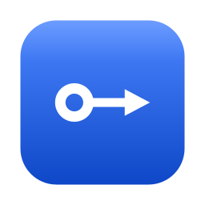
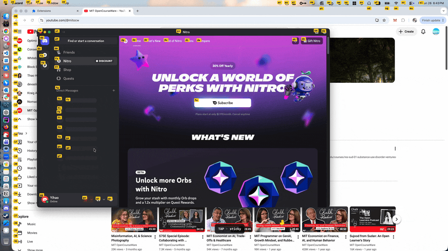
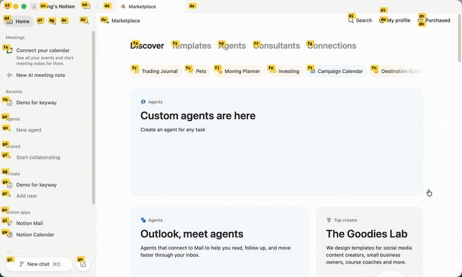
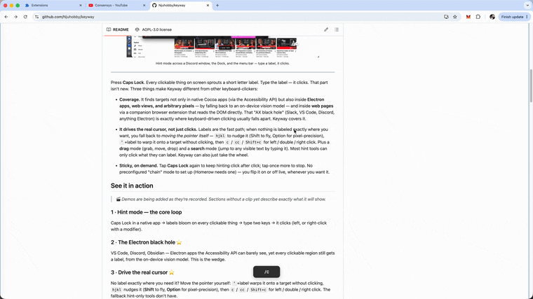
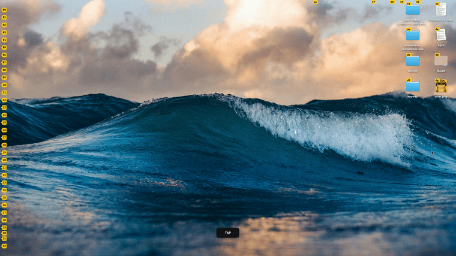
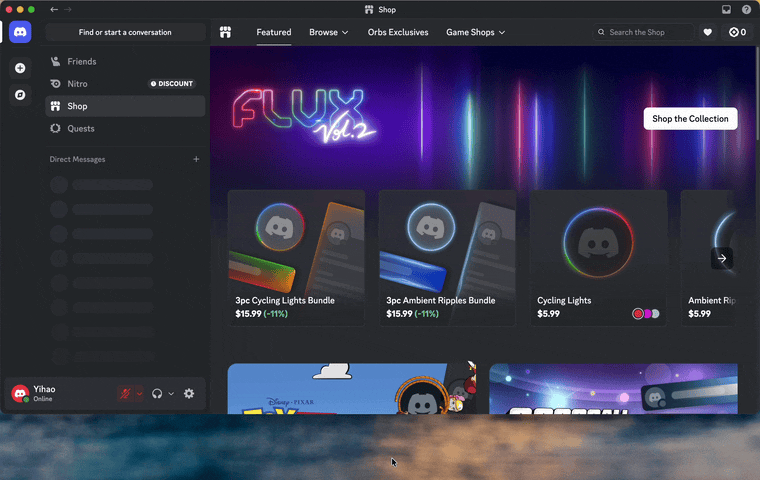
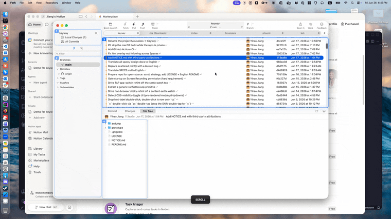
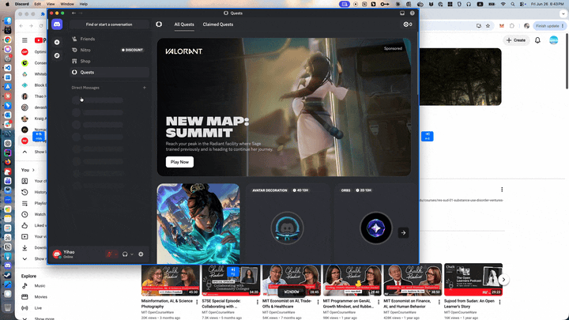
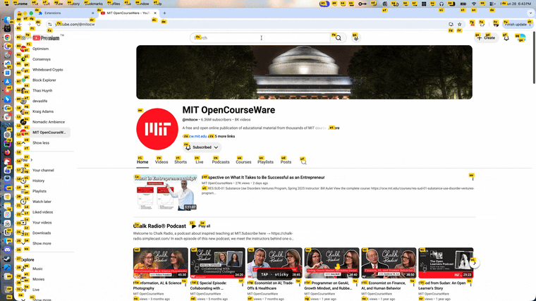

<div align="center">



# Keyway

**Drive your Mac entirely from the keyboard.**

Click anything, scroll anything, move any window — without your hands ever
leaving the home row. Even in Electron apps and web views that other tools
can't see.

[](LICENSE)




<sub>Hint mode across a Discord window, the Dock, and the menu bar — type a label, it clicks.</sub>

</div>

---

Press **Caps Lock**. Every clickable thing on screen sprouts a short letter
label. Type the label — it clicks. That part isn't new. What sets Keyway apart:

- **Coverage.** It finds targets not only in native Cocoa apps (via the
  Accessibility API) but also inside **Electron apps, web views, and arbitrary
  pixels** — by falling back to an on-device vision model — and inside **web
  pages** via a companion browser extension that reads the DOM directly. That
  "AX black hole" (Slack, VS Code, Discord, anything Electron) is exactly
  where keyboard-driven clicking usually falls apart. Keyway covers it.

- **It's built around modes, not one trick.** Hint-clicking is just the
  default. A Caps Lock chord drops you straight into another keyboard mode —
  **scroll**, **window move**, **window resize**, **drag**, **text search** —
  each a focused interaction sharing the same `hjkl` muscle memory. Modes are
  the core design, and the system is extensible: new capability is a new mode,
  not a new app, so the keyboard-driven surface keeps growing. That's what
  makes Keyway open-ended rather than a single party trick.

- **It drives the real cursor, not just clicks.** Labels are the fast path;
  when nothing is labeled exactly where you want, you fall back to *moving the
  pointer itself* — `hjkl` to nudge it (Shift to fly, Option for
  pixel-precision), `'`+label to warp it onto a target without clicking, then
  `c` / `cc` / `Shift+c` for left / double / right click. Most hint tools can
  only click what they can label. Keyway can also just take the wheel.

- **Sticky, on demand.** Tap **Caps Lock** again to keep hinting click after
  click; tap once more to stop. No preconfigured "chain" mode to set up
  (Homerow needs one) — you flip it on or off live, whenever you want it.

## See it in action

### 1 · Hint mode — the core loop
Caps Lock in a native app → labels bloom on every clickable thing → type the
label → it clicks (left, or right-click with a modifier). _(See the demo at the
top of this page.)_

### 2 · Sticky, on demand
Tap **Caps Lock** again to keep hinting click after click; it re-hints on its own
as content loads or you switch apps / Spaces. Tap once more to stop. No "chain"
mode to preconfigure the way Homerow needs — you flip it live. _(Also in the
demo at the top.)_

### 3 · Drive the real cursor


No label exactly where you need it? Move the pointer yourself: `'`+label warps
it onto a target without clicking, `hjkl` nudges it (**Shift** to fly,
**Option** for pixel-precision), and **double-tapping** a direction (`hh` / `jj`
/ `kk` / `ll`) jumps it half a screen that way — **Shift + double-tap** jumps a
whole screen, so you cross big distances in one go. Then `c` / `cc` / `Shift+c`
for left / double / right click. The fallback hint-only tools don't have.

### 4 · Drag mode
From TAP (or TAP sticky), press `v` to start a drag — `mouseDown` at the cursor,
`hjkl` to move, drop to release. A real press-drag-release, entirely from the
keyboard, on anything draggable.



_Dragging out a text selection to copy and paste a passage._



_Or dragging a file / picture._

### 5 · Search mode


From TAP (or TAP sticky), press `/` and type any visible text — Keyway OCRs the
focused window, matches it, and labels the hits so you jump straight to one.

### 6 · Scroll mode


**Caps Lock + d** enters scroll mode and outlines every scrollable area with a
number; press that number to pick one. Then `d` / `u` scroll it (hold for
continuous, **Shift** to accelerate) and `gg` / `G` jump to top / bottom.

Web pages are special: with the extension, `d` / `u` / `gg` / `G` scroll the
page **directly, no mode to enter** — Vimium-style. (Caps Lock + d is disabled
there, since modeless scrolling already covers it.)

### 7 · Move & resize windows


**Caps Lock + w** enters resize, **Caps Lock + m** enters move. In resize, grow
any edge with `hjkl` (double-tap an axis to pull the opposite edge inward); in
move, pan the whole window with `hjkl`. Hold **Shift** to fly, **Option** for
fine steps — all from the keyboard, no mouse.

### 8 · Web pages, precisely (Chrome / Firefox)


With the companion extension, hints come straight from the DOM — pixel-perfect
and iframe-aware on any real page. And in **sticky mode they refresh themselves
as the page changes**: scroll, open a menu, navigate to a new page — the labels
re-scan to match what's on screen, so you keep clicking without pressing Caps
Lock again.

## What it can do

| | |
|---|---|
| 🎯 **Hint mode** | Label every clickable element, type the label to click. The fast path. |
| 🕳️ **Beyond native AX** | Electron (Slack, VS Code, Discord), WebViews and Catalyst apps expose almost nothing to the Accessibility API. Keyway fills that black hole with an on-device [OmniParser](https://github.com/microsoft/OmniParser) vision model. |
| 🖱️ **Drive the real cursor** | When no label sits where you need it, move the pointer yourself: `hjkl` to nudge (Shift to fly, Option for pixel-precision), `'`+label to warp onto a target without clicking, then `c` / `cc` / `Shift+c` for left / double / right click. The fallback hint-only tools don't have. |
| ✊ **Drag mode** | Grab at the cursor, move with `hjkl`, drop — full drag-and-drop without the mouse. |
| 🔎 **Search mode** | Type any visible text to jump to it (OCR + character match), then pick the match with a hint label. |
| 🌐 **Real web pages** | A browser extension reads the DOM directly for precise, iframe-aware hints. |
| 📜 **Scroll & windows** | Keyboard scrolling (multi-area picker) and window move/resize, plus Vimium-style modeless scrolling on web pages. |
| 🧲 **Sticky, on demand** | Tap **Caps Lock** again to keep hinting click after click — and it auto re-hints as content loads or you switch apps/Spaces; tap once more to stop. No "chain" mode to preconfigure (Homerow needs one). |
| 🔒 **Local-only** | Runs entirely on-device. No telemetry, no network calls beyond the local app↔extension socket. |

## Architecture

The short version: hints come from three sources merged into one overlay — an
**Accessibility walk** for native apps, an **on-device vision model** for the
AX black holes (Electron / WebViews), and a **browser extension** that reads
the DOM directly. The mode/sub-state engine, the event pipeline, the
settle-detection that times rehints to the actual frame, the per-app
correction layer, the native-messaging bridge — each is its own subsystem with
its own trade-offs.

Rather than summarize them badly here, the design is written up in full —
[`prototype/SPECS.md`](prototype/SPECS.md) is the entry point, with per-subsystem
deep-dives (and the war stories behind them) in
[`prototype/specs/`](prototype/specs/):

| | |
|---|---|
| [`event-pipeline.md`](prototype/specs/event-pipeline.md) | The CGEventTap pipeline and how keys are consumed per mode |
| [`hint-discovery.md`](prototype/specs/hint-discovery.md) · [`hint-rendering.md`](prototype/specs/hint-rendering.md) | Finding targets, and drawing labels across Spaces |
| [`omniparser-fallback-design.md`](prototype/specs/omniparser-fallback-design.md) | The vision fallback for AX-invisible apps |
| [`browser-support-design.md`](prototype/specs/browser-support-design.md) | The DOM extension and native-messaging bridge |
| [`modes.md`](prototype/specs/modes.md) · [`scroll-mode-design.md`](prototype/specs/scroll-mode-design.md) | The mode / sub-state model and per-mode behavior |
| [`per-app-correction-design.md`](prototype/specs/per-app-correction-design.md) · [`settings-design.md`](prototype/specs/settings-design.md) | Per-app offset correction and settings |

## Install

### Download a pre-built build

Grab the latest `Keyway-vX.Y.Z.zip` from the
[**Releases**](https://github.com/Njuhobby/keyway/releases) page, unzip it,
and drag **Keyway.app** into `/Applications`.

The build is ad-hoc signed, **not notarized by Apple**, so Gatekeeper blocks
it the first time. Clear the quarantine flag once, from Terminal:

```sh
xattr -dr com.apple.quarantine /Applications/Keyway.app
```

Then double-click to launch.

Or do it through the UI: double-click `Keyway.app` (you'll get a "could not
verify" dialog — click **Done**, *not* Move to Trash), then go to **System
Settings → Privacy & Security**, scroll to the **Security** section, and click
**Open Anyway** next to the Keyway notice. Confirm with Touch ID, then open the
app again.

> On macOS 15 (Sequoia) and later, the old **right-click → Open** shortcut no
> longer bypasses Gatekeeper for un-notarized apps — use one of the two methods
> above.

On first launch a **Keyway Setup** window walks you through the two permissions
below: click **Open Settings** on each row to grant it, then **Restart Keyway**
to apply them in one step. Because the build isn't signed with a stable
Developer ID, a future version may ask you to re-grant.

### Build from source

A self-built app skips the Gatekeeper prompt entirely.

```sh
cd prototype
./run.sh        # swift build + ad-hoc re-sign + (re)launch
```

A key icon appears in the menu bar (a red `!` badge next to it means a
required permission is missing). On first launch the **Keyway Setup** window
guides you through the two permissions — grant each, click **Restart Keyway**,
then press **Caps Lock** to enter hint mode.

To produce a distributable `.app` and a release zip:

```sh
cd prototype
./package-app.sh    # → build/Keyway.app  (signed, with icon)
./release.sh        # → build/Keyway-v<version>.zip  (bundle-safe, + sha256)
```

> See [`prototype/SPECS.md`](prototype/SPECS.md) for the full setup, the mode
> reference, and the architecture deep-dives.

#### Browser extension (optional, for web-page hints)

Load `prototype/extension/` as an unpacked extension (Chrome:
`chrome://extensions` → Developer mode → Load unpacked; Firefox: build with
`build-firefox.sh`, then load via `about:debugging`) and install the
native-messaging host with the provided script. Without it, web pages still
work through the vision fallback, just less precisely.

### Uninstall

```sh
cd prototype
./uninstall.sh
```

It quits Keyway, restores Caps Lock, and removes the app plus everything it
leaves behind (caches, preferences, the native-messaging host, and the
permission grants). If you only have the downloaded `.app`, drag it to the
Trash, then run `hidutil property --set '{"UserKeyMapping":[]}'` to restore
Caps Lock if it's still acting as the trigger.

## Requirements

- macOS 13 (Ventura) or later, Apple Silicon
- To build from source: a Swift toolchain (Xcode or the Swift CLT)
- Two permissions, **both required** (granting either needs a restart to take
  effect — macOS caches them per process):
  - **Accessibility** — to read the AX tree and synthesize clicks/keys
  - **Screen Recording** — for the vision fallback and the settle detection

## Permissions & privacy

Keyway runs entirely on your machine. **No telemetry, no network calls**
other than the local socket between the app and the browser extension. The
permissions are used only for what's described above; screen captures are
processed in memory and not written to disk (outside an opt-in debug flag).

## Status

**Early prototype / research project.** It works and is usable daily, but it
is rough, unsigned, and the code lives under `prototype/`. Expect sharp
edges. Built in the open to share the approach.

## License

**[AGPL-3.0-or-later](LICENSE).** Keyway bundles an icon-detection model
derived from [OmniParser](https://github.com/microsoft/OmniParser) (built on
Ultralytics YOLO), whose weights are AGPL-licensed; the AGPL applies to the
combined work, so the whole project is AGPL-3.0. If you run a modified version
as a network service, the AGPL requires you to offer its source.

Third-party attributions are in [NOTICE.md](NOTICE.md).

## Acknowledgements

- [Vimium](https://github.com/philc/vimium) — the browser extension's
  element-detection heuristics are derived from it (MIT).
- [OmniParser](https://github.com/microsoft/OmniParser) — the on-device
  icon-detection model.
- [Homerow](https://homerow.app) — prior art and inspiration for
  keyboard-driven clicking on macOS.
